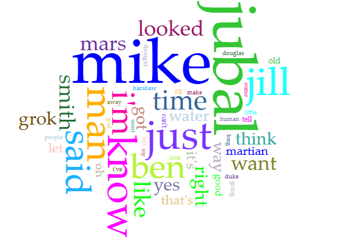



# Distant Reading Assignment 

I used Voyant to search this website, and Copilot to do some interpreting. [Stranger in a Strange Land by Robert Heinlein](https://bobson.ludost.net/copycrime/Robert%20A.%20Heinlein%20-%20Stranger%20In%20A%20Strange%20Land.html)

Below is the Cirrus Word cloud generated by Voyant:

---
I also utilized Microsoft Copilot, below is a few prompts from those interactions:

Deeper Distant Reading Analysis
1. The Novel Is About Cultural Outsiderhood

Even a basic frequency analysis would likely show repeated references to "Smith," "Martian," "man," and "human." These recurring terms suggest that the novel is fundamentally concerned with identity and belonging. Valentine Michael Smith exists between two worlds: biologically human but culturally Martian. A distant reading approach can reveal how often these concepts appear, indicating their importance to the text, but it cannot fully explain their philosophical significance.

2. Character Centrality vs. Thematic Centrality

Voyant may identify "Smith" as the most frequently occurring proper noun. However, frequency alone does not explain why he matters. Through closer examination, Smith functions less as a traditional protagonist and more as a lens through which readers examine Earth society. This illustrates a key limitation of distant reading: it identifies patterns but cannot distinguish between a character who drives the plot and one who symbolizes larger ideas.

3. Language Reflects Social Critique

As the novel progresses, terms connected to religion, government, law, morality, and social institutions would likely appear repeatedly. This pattern suggests that Heinlein is using science fiction to explore and critique human social systems. A trend graph might show increasing occurrences of religious language in later sections of the novel, reflecting Smith's growing role as a spiritual leader.

4. The Importance of "Grok"

One of the most significant concepts in the novel is the Martian word "grok." While Voyant can count its appearances, it cannot explain its meaning. The concept combines understanding, empathy, identity, and spiritual connection in ways that have no direct English equivalent. This is an excellent example of where computational analysis reaches its limits. The most important idea in the novel cannot be understood through frequency alone.

---

I used Voyant Tools and Microsoft Copilot to analyze Stranger in a Strange Land and see what each tool could show me about the book. Voyant was helpful for pointing out words and ideas that came up a lot, especially things connected to the characters, humanity, Martian culture, religion, and society. Seeing how often certain words appeared made some patterns in the novel a lot easier to notice than they would have been just from reading it normally.

Voyant does have limits, though. It can tell me that a word shows up a lot, but it cannot really explain why that word is important. It also cannot fully understand things like symbolism, irony, character motivation, or ideas like what it means to “grok.” Copilot was better at explaining themes and making connections between ideas, but its answers were more based on interpretation and could sometimes be too general or miss the meaning of a passage.

Using both tools together showed me that distant reading is probably best for finding patterns and giving me ideas about what to look at more closely. Voyant gives me the data, Copilot can help suggest what that data might mean, but I still need to go back to the actual book to see if those ideas really hold up.

Here is a fun link to a [Markdown Cheatsheet](https://www.markdownguide.org/cheat-sheet/). Once you grasp the basics here, go add "Markdown" to your list of skills on your resume!
